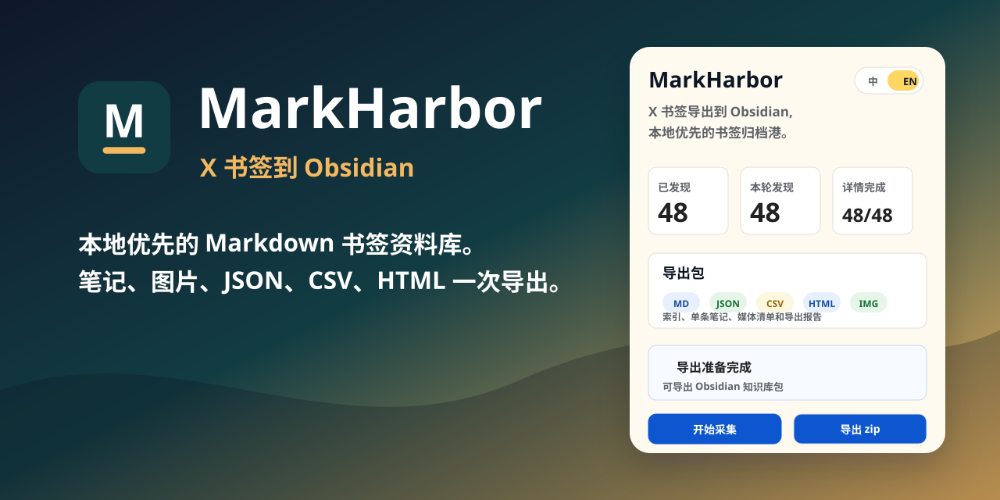
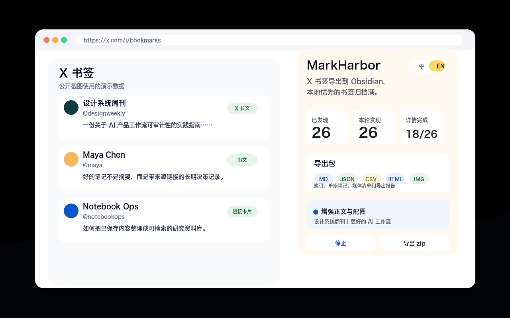
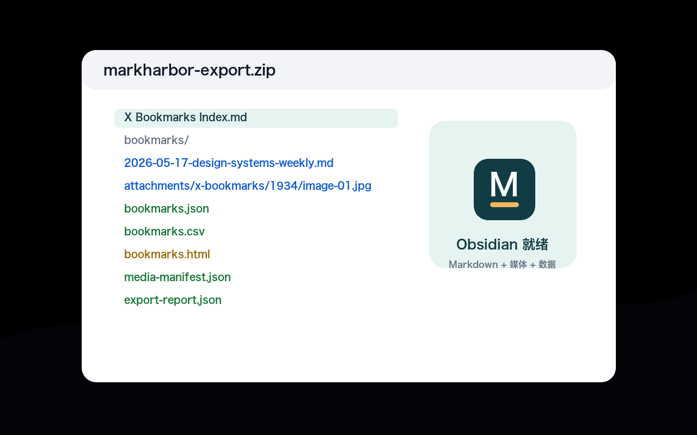
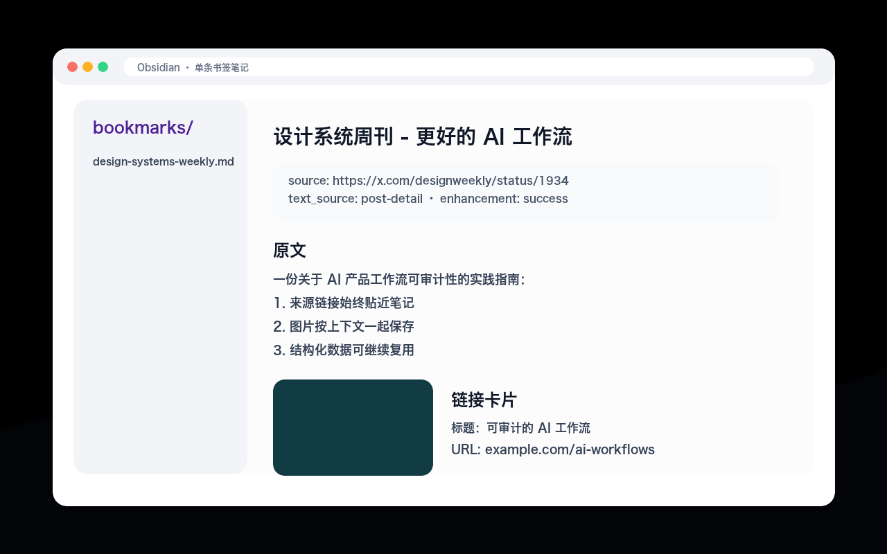
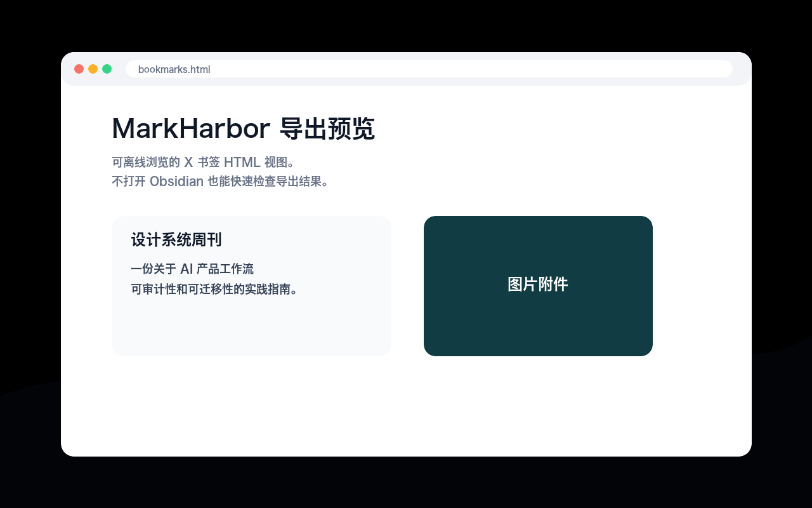

# MarkHarbor

[简体中文](README.md) | [English](README.en.md)

[](https://github.com/dososo/markharbor/actions/workflows/ci.yml)
[](https://github.com/dososo/markharbor/releases/latest)
[](LICENSE)
[](docs/INSTALL.md)

**X Bookmarks to Obsidian, a local-first archive harbor for saved posts.**

MarkHarbor turns loaded X Bookmarks into an Obsidian-ready local archive: Markdown notes, a clickable index, images, JSON, CSV, HTML, a media manifest, and an export report.

> MarkHarbor is a local-first Chrome extension. It reads the X Bookmarks already loaded in your own browser and exports local files. It is currently distributed through GitHub Releases as an unpacked extension and is not yet listed on the Chrome Web Store.



## Status

- Current version: `0.1.11`
- Distribution: GitHub Releases zip, loaded manually as an unpacked Chrome extension
- License: MIT
- Chrome Web Store: not listed yet
- Latest release: [GitHub Releases](https://github.com/dososo/markharbor/releases/latest)

## Screenshots

[Demo video](https://github.com/dososo/markharbor/releases/download/v0.1.11/markharbor-demo-2026-05-17.mp4)

| Collecting | Export structure |
| --- | --- |
|  |  |

| Obsidian note | Local HTML preview |
| --- | --- |
|  |  |

## Why

X Bookmarks are useful for saving things quickly, but they are not a long-term knowledge base:

- Bookmarks become hard to search and revisit.
- Valuable posts may disappear or change.
- The bookmarks list often shows truncated text.
- X Article content, images, and link cards are hard to preserve in context.
- Obsidian users need local Markdown files, not a locked platform list.

MarkHarbor helps move saved X content into files you control.

## What It Does

MarkHarbor is a Chrome Manifest V3 extension for `https://x.com/i/bookmarks`. It assists page scrolling, collects loaded bookmarks, and exports a zip package.

Features:

- Collect loaded X Bookmarks from the page.
- Auto-scroll to load more bookmarks, with manual stop support.
- Separate `Discovered` from `Details done` so list discovery is not confused with full detail capture.
- Generate one Markdown note per bookmark.
- Generate a clickable `X Bookmarks Index.md`.
- Export JSON, CSV, TXT, and HTML.
- Download accessible X image attachments into per-bookmark folders.
- Try to enrich truncated X post text from same-origin X detail pages.
- Try to capture X Article body text, inline images, and readable structure.
- Preserve link card title, description, and URL.
- Do not download videos; preserve source links and visible preview information.
- Chinese and English popup UI.

## How It Differs From Similar Tools

Many X/Twitter bookmark tools focus on search, cloud sync, tags, folders, team sharing, or generic exports.

MarkHarbor is narrower:

- **Obsidian-first**: index, per-bookmark notes, YAML properties, attachment folders, and a media manifest.
- **Local-first**: no cloud account, no upload, no hosted database.
- **X Bookmarks focused**: handles loaded bookmark cards, infinite scrolling, truncated text, X Articles, images, and link cards.
- **Structured exports**: Markdown for Obsidian, JSON for programs, CSV for spreadsheets, HTML for browsing, TXT for minimal backup.
- **Safe fallback**: detail enhancement failures preserve visible bookmark content instead of breaking the export.
- **Open source and auditable**: permissions, export structure, and parsing logic are visible in the repository.

## MarkHarbor vs Obsidian Web Clipper

[Obsidian Web Clipper](https://obsidian.md/clipper) is the official general-purpose web clipping tool for Obsidian. It is great for clipping the current page, selected text, highlights, templates, variables, and site rules.

MarkHarbor is not a replacement for Web Clipper. It focuses on a different workflow: batch-exporting X Bookmarks into an Obsidian-ready archive.

| Area | Obsidian Web Clipper | MarkHarbor |
| --- | --- | --- |
| Main target | Current web page | X Bookmarks list |
| Workflow | Clip one page or selection | Batch collect loaded bookmarks |
| Templates | Powerful and customizable | Fixed Obsidian archive structure |
| X Bookmarks batch export | Not its main purpose | Core purpose |
| X Article enhancement | Depends on the current clipped page | Detail enhancement for X Article pages |
| Attachments | Depends on clipper workflow | Per-bookmark folders under `attachments/x-bookmarks/` |
| Output | Obsidian clipping workflow | Auditable zip package |

## Install

MarkHarbor is not on the Chrome Web Store yet. The recommended public installation path is a GitHub Release zip loaded as an unpacked extension.

### Option A: Install From GitHub Releases

1. Open this repository's `Releases` page.
2. Download the latest `markharbor-vX.Y.Z.zip`.
3. Unzip it.
4. Open `chrome://extensions`.
5. Enable `Developer mode`.
6. Click `Load unpacked`.
7. Select the extracted `markharbor/` folder that contains `manifest.json`.
8. Open `https://x.com/i/bookmarks`.
9. Click the MarkHarbor extension icon.

Keep the extracted `markharbor/` folder on disk. Chrome loads unpacked extensions from that local folder.

### Option B: Build From Source

```bash
npm ci
npm run build
```

Then load the generated `dist/` folder from `chrome://extensions`.

### Option C: Package Locally

```bash
npm run package
```

This creates:

```text
release/markharbor-vX.Y.Z.zip
```

See [docs/INSTALL.md](docs/INSTALL.md) for more installation details.

## Usage

1. Log in to X.
2. Open `https://x.com/i/bookmarks`.
3. Click the extension icon.
4. Keep image download and advanced full article mode enabled if needed.
5. Click `Start collection`.
6. Wait for scrolling and detail enhancement.
7. Click `Stop` if you want to end early.
8. Click `Export zip`.
9. Unzip the package into your Obsidian vault.
10. Start from `X Bookmarks Index.md`.

## Export Structure

```text
X Bookmarks Index.md
bookmarks/
  2026-05-16-author-title.md
attachments/
  x-bookmarks/
    1234567890/
      image-01-example.jpg
bookmarks.json
bookmarks.csv
links.txt
bookmarks.html
media-manifest.json
export-report.json
```

## Privacy And Permissions

The extension:

- Does not require a cloud account.
- Does not upload bookmark data.
- Does not read your X password.
- Does not read X cookies.
- Does not call undocumented X internal APIs.
- Does not silently collect data before you start.
- Does not download X videos.

Permissions:

| Permission | Purpose |
| --- | --- |
| `activeTab` | Communicate with the active X Bookmarks page |
| `downloads` | Save the exported zip |
| `scripting` | Inject the collector and read rendered detail pages |
| `https://x.com/*` | Work on X Bookmarks and same-origin detail pages |
| `https://pbs.twimg.com/*` | Download X image attachments |

## Known Limitations

- It cannot guarantee exporting your entire historical bookmark archive.
- Completeness depends on what X actually loads in the page.
- X DOM changes may break parsing.
- X Article capture is best-effort and safely falls back when detail rendering fails.
- External article full text is not fetched.
- X videos are not downloaded.
- No cloud sync, AI summary, auto-tagging, team collaboration, or full-text search yet.

## FAQ

### Does it export all X Bookmarks?

Not guaranteed. It collects what the X Bookmarks page can load during scrolling.

### Why does the count jump immediately after starting?

`Discovered` means bookmarks found in the current page DOM. It does not mean all detail text and images are finished. Check `Details done` for enrichment progress.

### Does it upload my data?

No. Export runs locally and saves a zip file.

### Does it fetch external article full text?

No. It only preserves link card metadata visible on X. Fetching arbitrary external pages would require broader permissions and create stability, copyright, and review risks.

### Does it download videos?

No. It only saves source links and visible preview information.

## Development

```bash
npm ci
npm test
npm run typecheck
npm run build
npm run package
```

## License

MIT License. See [LICENSE](LICENSE).
